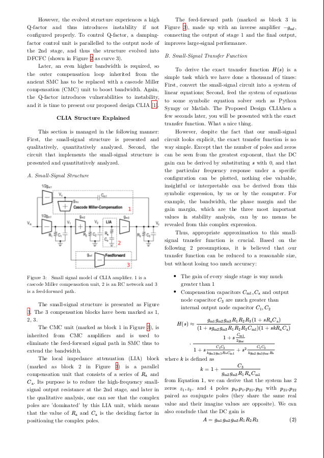
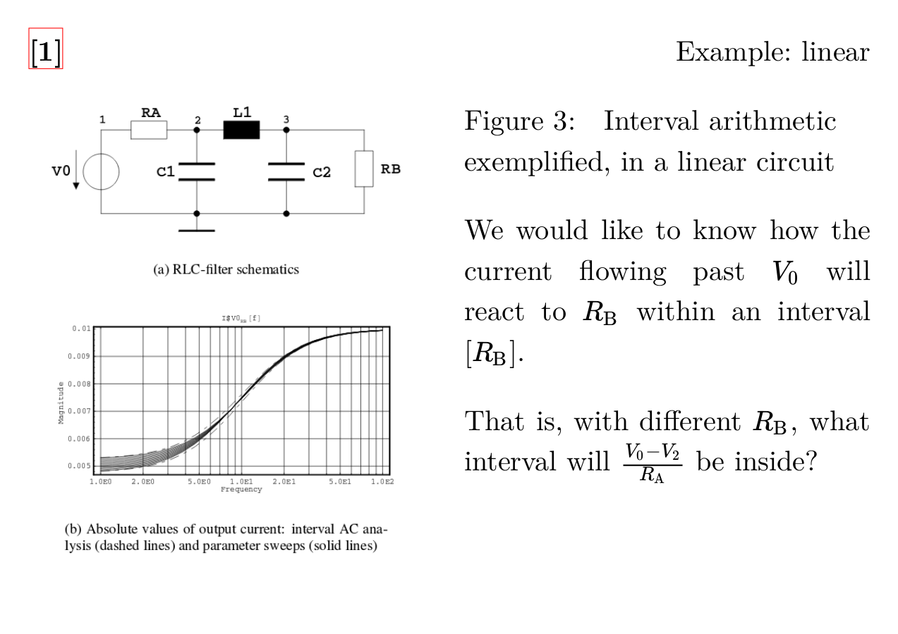

# no-latex

An experimental alternative to LaTeX in scientific writing, using web technologies.

This is a demo showing how web technologies like HTML, CSS can smooth your scientific writing experience.

- [Quickstart](#Quickstart)
- [How it works](#How-it-works)
- [Why](#Why)
- [Feature checklist](#Feature-checklist)
- [Future](#Future)

## Demos 

<table>
    <tr>
        <td style="max-width: 49%;">
            
        </td>
        <td style="max-width: 49%;">
            
        </td>
    </tr>
    <tr>
        <td>
            <a href="power-ic-report/Cascode Miller-Compensated Three-Stage Amplifier.pdf">scientific report</a>
        </td>
        <td>
            <a href="literature-review-slideshow/Literature Review.pdf">slideshow</a>
        </td>
    </tr>
</table>

## Quickstart

1. `cd` to this project directory
1. Install WeasyPrint

    I recommend using a virtual environment by
    ```bash
    python3 -m venv .
    ```
    activate the virtual environment by
    ```bash
    source ./bin/activate
    ```
    and install WeasyPrint by
    ```bash
    pip install weasyprint
    ```

1. Install mathjax-node-page

    ```bash
    npm install mathjax-node-page
    ```

    Note that you have to get a working(I mean latest) nodejs. For Debian/Ubuntu users, installation with `apt install nodejs` will get you an ancient version of nodejs and npm.

1. See the demo

    ```bash
    cd  simple-columned-demo
    bash generate.bash
    ```

There are also other demos in this repository, but some of them depend on Chrome to work, and many features like header and footer are not available (since modern browsers have not yet implemented those specs). 

## How it works

This workflow depends on
- [WeasyPrint](https://github.com/Kozea/WeasyPrint) to convert HTML to PDF
- [mathjax-node-page](https://github.com/pkra/mathjax-node-page/) to preprocess HTMLs containing raw LaTeX math formula or written in MathML

Alternatively, if you do not need features like headers or footers, you can safely rely on browsers like Chrome to output PDF.

### Math formulas

#### With WeasyPrint

WeasyPrint currently does not support JavaScript (and probably will never support it by its nature), so any raw math formulas can only be converted to static HTML or SVG by some preprocessing programs outside it, rather than simply inserting a `<script>` in the HTML to help us take care of it. This is what the first line in `generate.bash` does. Hooray.

However, it is not the whole story yet. Because WeasyPrint does NOT support inline SVG, I have to use commonHTML as the output format of math formulas. This is the purpose of `--output=CommonHTML` flag. The `--dollars` flag is to convert also inline formulas (such as `$ a = b^2 $`)

Also note that it will take a ridiculously long time when you have a lot of formulas.

#### With Chrome

Use what you would use on a real site, such as KaTeX and MathJax. Chrome outputs much more quickly.

### Auto-numbering

Currently I use the `counter` feature in CSS to produce auto-numbered figure caption prefix like `Figure 2` and table caption prefix like `Table 2`.

For equation numbering, first configure MathJax to auto number all equations delimited within the `equation` environment (`\begin{equation}...\end{equation}`), and then use `\label{foo}` right before `\end{equation}`, just as you usually do in LaTeX, and when referring to an equation, there are two ways
- use `$\ref{foo}$`; this automatically puts the numbering of its targeted equation right after, like LaTeX
- use a hyperlink with href set to `#mjx-eqn-foo`; does not (yet) put a proper numbering

### Figure and table reference

In LaTeX, if you want to refer to an aforementioned figure or table, first you need to assign name to it such as `fig:heat`, by adding `\label{fig:heat}` right after `\caption{}` in a `figure` environment. Then you can refer to the figure somewhere else in the article by referring to its previously assigned name. For example, when you write `As Figure~\ref{fig:heat} shows`, LaTeX outputs `As Figure 2 shows`.

Referring to an object is even simpler in HTML. You put an attribute `id` on the element that you would like to refer to later, e.g. ``, and then you put a hyperlink somewhere else that has its `href` set to the `id`, e.g. `<a href="#fig:heat">Figure</a>`. In WeasyPrint with cairo version >= 1.15, hyperlinks will be converted correctly when output to PDF. Nothing you need to worry about.

However, I have not come up with a pure HTML/CSS approach that can give you the figure number when you refer to it. And this feature is crucial because your potential readers might read your PDF on a real paper sheet instead of a computer screen, and the clickable hyperlinks would become totally meaningless.

#### With Chrome

With a real browser, JavaScript is available, providing much convenience. I have written a simple script (check out `power-ic-report/auto-numbering.js`) to scan the document for figures, tables, bibitems and the hyperlinks that refer to them, and then resolve their numbering: 
1. add the right numbering onto their `[data-id]` which will later be used by CSS to insert `::before` to display the numbering, e.g., `Figure 1: foo bar` figure caption under a figure.
1. find the numbering of whatever the hyperlink is referring to, and add the right number onto their `[data-target-id]` which will later be used by CSS to display the numbering, e.g., `As Figure 1 shows, foo bar.` in text.

Works pretty well!

### Bibliography citation

#### With WeasyPrint

The same problem as figure and table reference.

Then we have a preprocessed HTML, and it is ready to be input to WeasyPrint to produce a PDF. So far so good.

#### With Chrome

Solved with help of JavaScript.

## Why

I write a lot of reports and homework, and when I am writing, I sometimes wish that LaTeX were never created. I feel at least that
- LaTeX comes with a *huge* package.

    To get a working binary of LaTeX for your daily writing, you have to install a lot of things.

- Preview not on time.

    You have to `xelatex main` and wait a long time until it gets your output out.

    In this workflow, you make changes, and can view your changes and debug quickly in the browser, then you can decide whether to convert it to PDF.

- LaTex is not doing a good job at separation of concerns.

    This is big topic. I will just talk about things I have felt so far.

    The original TeX language was more like a markup language with some styling functionality to me. LaTeX tried to hide those trivial things and to let authors focus just on the content, by providing many macros like `\section{}`. 

    If you strictly stick to the default style that LaTeX provides to you, it is OK forever. However, when you are the boss of a publishing house and you want your books to have a totally different style, it will be a lot of pain to you to change it.

- LaTeX requires some really magic tricks to achieve the style that you think would otherwise be easy to accomplish.
  
    Theoretically, there is probably nothing you can achieve *only* with CSS but not with TeX, but the effort to make them happen is quite different. Some styles can be done with 1-line CSS but hundreds of `\magic{}`.

- Poor support for modern character sets.

    Yes, in order to display text written in other languages than English, you have to `\usepackage` a lot.

While LaTeX has its advantage(s)
- Remarkable simplicity, at least for me, in formatting math formulas.

    That is why I hope to make use of their good parts. In web technologies, we have a so-called MathML as an alternative to display math formulas, but it is hardly human-readable and human-writable.

## Feature checklist

With weasyprint, you can
- [x] Styling with CSS (headers, footers, anything)
- [x] Display math formulas e.g. `$$ a = b^2 $$`
- [x] Inline math formulas e.g. `$ a = b^2 $`
- [ ] Formula auto-numbering
- [ ] Formula reference e.g. `\ref{eq:heat}`
- [x] Figure and table auto-numbering e.g. `Figure 1`
- [ ] Figure and table reference e.g. `\ref{tab:heat}`
- [x] Columned layout e.g. `\twocolumn`
- [ ] Floats e.g. `\begin{float}`
- [ ] Table of Content auto-generation e.g. `\tableofcontents`
- [x] Bibliography auto-numbering e.g. `\bibitem`
- [ ] Bibliography citation e.g. `\cite{shi2018}`
- [ ] Bibliography auto-generation

With Chrome and not weasyprint, you can
- [ ] Styling headers or footers (like adding page number on page margin)
- [x] Display math formulas e.g. `$$ a = b^2 $$` (does not require preprocessing)
- [x] Inline math formulas e.g. `$ a = b^2 $` (does not require preprocessing)
- [x] Formula auto-numbering
- [x] Formula reference e.g. `\ref{eq:heat}`
- [x] Figure and table auto-numbering e.g. `Figure 1`
- [x] Figure and table reference e.g. `\ref{tab:heat}` (with JavaScript, check out `power-ic-report/auto-numering.js`)
- [x] Columned layout e.g. `\twocolumn`
- [ ] Floats e.g. `\begin{float}`
- [ ] Table of Content auto-generation e.g. `\tableofcontents`
- [x] Bibliography auto-numbering e.g. `\bibitem`
- [x] Bibliography citation e.g. `\cite{shi2018}` (with JavaScript, check out `power-ic-report/auto-numering.js`)
- [ ] Bibliography auto-generation

Generally, if you do not need headers or footers, use the Chrome approach and it saves you plenty of time to wait for rendering.

## Future

- Magazines and publishing houses can accept articles written in Markdown or HTML or any markup language they like that can be converted to HTML (one language that comes to my mind is reStructuredText).
- Reviewing and editing scientific writings becomes easy. 
- Scientists have less worries because there is no LaTeX to worry about (except the math formulas which I pretty enjoy typing them), and they can even write in Markdown which will save them plenty of time in writing. We will see tons more progress in science and technology!
- **Mainstream browsers add complete support for CSS Paged Media Specification.**