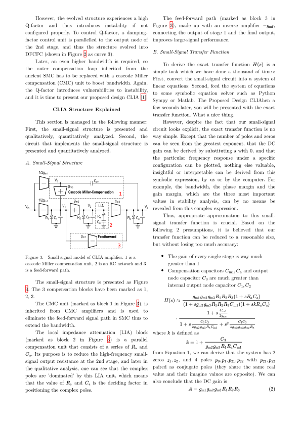

# power-ic-report



All hyperlinks shown above is clickable, including links after `Figure` and `Equation`.

This is the report I wrote for Power IC course, written totally with web technologies. Check out the PDF for preview in this directory.

This demo is, however, a little different from other demos, because I used JavaScript in it, and thus I had to use Chrome to print the PDF. I did not use WeasyPrint because I found that WeasyPrint can not handle too many formulas, otherwise it takes a few minutes to output. For papers that do not require a header or a footer (or any CSS Page Media spec Chrome has not yet implemented), print with Chrome is a good idea because
- JavaScript is available (for auto numbering, and auto referencing)
- Formulas come out quickly (takes seconds vs. minutes with WeasyPrint)

I am still trying to reach a workaround for WeasyPrint to process documents with *many* formulas within acceptable duration.

## Usage

Open `main.html` in Chrome, and print to PDF.

If you want to write your own article based on this CSS and JS, you can refer to `main.html`. Basically, I use
```html
<figure id="label">
    
    <figcaption>Caption here</figcaption>
</figure>
```
to produce figures, and
```html
<figure id="label">
    <table>
        ...
    </table>
    <figcaption>Caption here</figcaption>
</figure>
```
for tables, and
```html
<ul class="bibliography">
    <li class="bibliography__item" id="dreyer">
        <span class="bibliography__item__authors">Alexander Dreyer</span>
        <span class="bibliography__item__title">Combination of Symbolic and Interval-Numeric Methods for Analysis of Analog Circuits</span>
    </li>
    <li class="bibliography__item" id="shi">
        <span class="bibliography__item__authors">Guoyong Shi</span>
        <span class="bibliography__item__title">Topological Approach to Symbolic Pole–Zero Extraction Incorporating Design Knowledge</span>
        <span class="bibliography__item__journal">IEEE Transactions on Computer-Aided Design of Integrated Circuits and Systems</span>
    </li>
</ul>
```
for bibliography (I confess it is a little bit complex for bibitem).